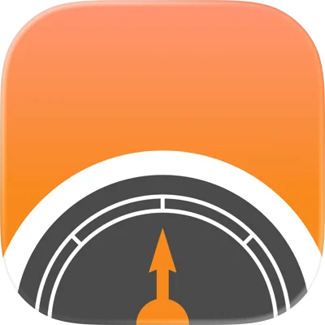

  
  <h1>Barometer for Watch</h1>
  
Atmospheric pressure right on your wrist

  

  <a href="https://barometer.justinchuby.com/feedback" class="link-card">
    
💬

    <h3>Send Feedback</h3>
    
Have suggestions or questions? We'd love to hear from you. Share your thoughts and help us improve.

  </a>

  <a href="https://github.com/justinchuby/barometer-project/issues" class="link-card">
    
<svg xmlns="http://www.w3.org/2000/svg" width="40" height="40" viewBox="0 0 24 24" fill="#333"><path d="M12 0c-6.626 0-12 5.373-12 12 0 5.302 3.438 9.8 8.207 11.387.599.111.793-.261.793-.577v-2.234c-3.338.726-4.033-1.416-4.033-1.416-.546-1.387-1.333-1.756-1.333-1.756-1.089-.745.083-.729.083-.729 1.205.084 1.839 1.237 1.839 1.237 1.07 1.834 2.807 1.304 3.492.997.107-.775.418-1.305.762-1.604-2.665-.305-5.467-1.334-5.467-5.931 0-1.311.469-2.381 1.236-3.221-.124-.303-.535-1.524.117-3.176 0 0 1.008-.322 3.301 1.23.957-.266 1.983-.399 3.003-.404 1.02.005 2.047.138 3.006.404 2.291-1.552 3.297-1.23 3.297-1.23.653 1.653.242 2.874.118 3.176.77.84 1.235 1.911 1.235 3.221 0 4.609-2.807 5.624-5.479 5.921.43.372.823 1.102.823 2.222v3.293c0 .319.192.694.801.576 4.765-1.589 8.199-6.086 8.199-11.386 0-6.627-5.373-12-12-12z"/></svg>

    <h3>Report Issues on GitHub</h3>
    
You can also open an issue on GitHub for bugs and feature requests.

  </a>

  
Made with ❤️ for Apple Watch users

  
<a href="/privacy-policy">Privacy Policy</a>

